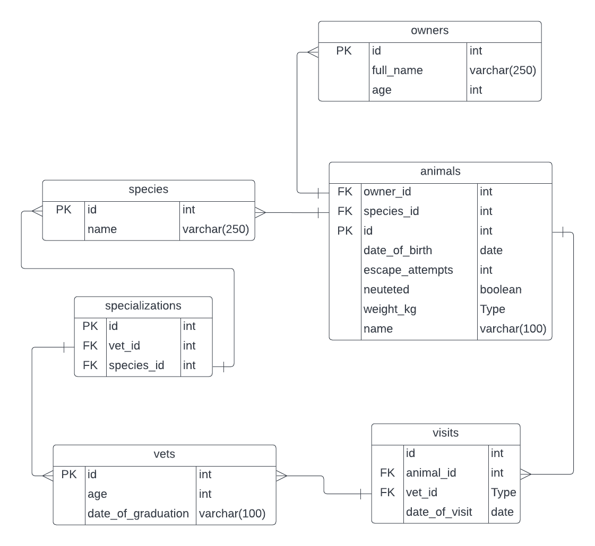

## Getting Started
This repository includes files with plain SQL that can be used to recreate a database:

- Use [schema.sql](./schema.sql) to create all tables.
- Use [data.sql](./data.sql) to populate tables with sample data.
- Check [queries.sql](./queries.sql) for examples of queries that can be run on a newly created database. **Important note: this file might include queries that make changes in the database (e.g., remove records). Use them responsibly!**

## Database Schema Design
  
## Authors

👤 **Author1**

- GitHub: [@tbello-7](https://github.com/tbello-7)
- Twitter: [@__tbello](https://twitter.com/__tbello)
- LinkedIn: [Oluwatomisin Bello](https://linkedin.com/in/tbello7)
- Portfolio: [tbello in Tech](https://tbello.tech)

👤 **Author2**

- GitHub: [@brainconnect93](https://github.com/brainconnect93)
- Twitter: [@brainconnect0](https://twitter.com/brainconnect0)
- LinkedIn: [Afolabi Akorede](https://linkedin.com/in/brainconnect93)

## 🤝 Contributing

Contributions, issues, and feature requests are welcome!

Feel free to check the [issues page](../../issues/).

## Show your support
Give a ⭐️ if you like this project!

## Acknowledgments
- Hat tip to the postgresql and microverse team
- Inspiration

## Resources To Use
- https://pgwatch.com/
## 📝 License
This project is [MIT](./MIT.md) licensed.
